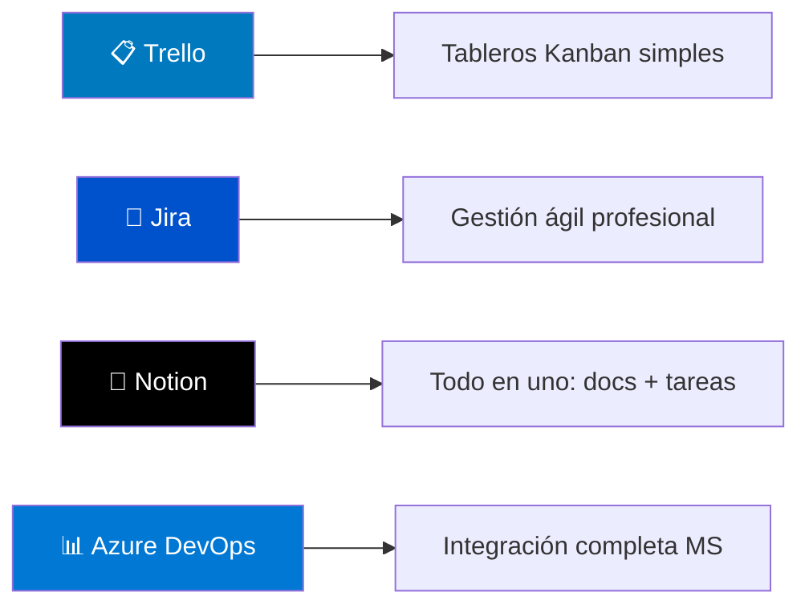

# La Planificación Ágil

Una vez que hemos validado que nuestra idea tiene potencial en la Fase de Iniciación, es hora de trazar un mapa para construirla. Pero en el mundo ágil, no creamos un mapa rígido y detallado para un viaje de dos años. Creamos un mapa flexible para llegar al siguiente punto de control: el lanzamiento del MVP. Esto es la Planificación Ágil.

## Teoría: El Mapa Hacia el Lanzamiento

La planificación excesiva es el enemigo de la agilidad. La clave es tener un plan claro, pero adaptable. Las herramientas para lograrlo son el Product Backlog, la priorización MoSCoW y la planificación en Sprints.

### ¿Qué es el Product Backlog?

Es el cerebro del proyecto. El **Product Backlog** es una lista única, ordenada y viva de todo lo que se podría desear en el producto. Para desmitificarlo, se puede usar una analogía simple: "El Product Backlog es como la lista de deseos de un niño para los Reyes Magos: es infinita, contiene de todo y no está ordenada por importancia. La priorización es el trabajo de los padres para decidir qué regalos son esenciales para hacerle feliz este año."

No es una simple lista de tareas; cada elemento (llamado "User Story" o "Elemento del Backlog") aporta valor al usuario final. Al principio del proyecto, contiene todas las ideas, funcionalidades y mejoras que se nos ocurren.

### Priorización MoSCoW: El Arte de Decir "No"

Aquí es donde se gana o se pierde la batalla del MVP. Un Backlog sin priorizar es inútil. El método **MoSCoW** es una técnica simple y poderosa para clasificar las funcionalidades y decidir qué es lo verdaderamente esencial. Esta técnica es la mejor arma contra el **"Scope Creep"** o "corrupción del alcance", el enemigo número uno de los proyectos, que consiste en añadir funcionalidades sin control hasta que el proyecto se vuelve inmanejable y nunca se entrega.

*   **M - Must Have (Debe Tener)**: No negociable. Sin esto, el producto no es viable. Es el corazón del MVP. Si falta un solo "Must Have", el lanzamiento se considera un fracaso.
*   **S - Should Have (Debería Tener)**: Importante, pero no vital para el lanzamiento inicial. Son las funcionalidades que aportan un gran valor y que se abordarán justo después del MVP si todo va bien.
*   **C - Could Have (Podría Tener)**: Deseable, pero menos importante. Son "guindas del pastel" que solo se considerarán si hay tiempo y recursos de sobra.
*   **W - Won't Have (No Tendrá)**: Funcionalidades que se acuerda explícitamente que no se abordarán en este lanzamiento (o quizás nunca). Esto es tan importante como decidir qué sí se va a hacer, porque libera al equipo de falsas expectativas.

Para un MVP, la regla es simple: **el MVP está compuesto exclusivamente por los "Must Have"**.

## Caja de Herramientas - Planificación

### Gestión de Product Backlog y Sprints

**Herramientas Recomendadas:**
- **Principiantes**: Trello (interfaz simple, perfecto para MVPs)
- **Equipos**: Jira (potente, estándar en la industria)
- **Híbrido**: Notion (combina documentación y gestión de tareas)
- **Microsoft**: Azure DevOps (si ya usas el ecosistema Microsoft)

### Planificación de Sprints

En lugar de un Diagrama de Gantt a largo plazo, el trabajo se divide en **Sprints** (o iteraciones). Un Sprint es un período de tiempo corto y fijo (normalmente de 1 a 4 semanas) durante el cual el equipo se compromete a construir un incremento de producto funcional. Al final de cada Sprint, el equipo debería tener algo tangible que mostrar. Esto permite recibir feedback constante y adaptar el plan sobre la marcha.

## Aplicación Práctica: Priorizando el Ecosistema TaskFlow

Veamos cómo nuestros dos equipos utilizan MoSCoW para definir el alcance exacto de sus MVPs **coordinándose como un ecosistema unificado**. La interdependencia entre equipos afecta directamente a sus prioridades.

:::: tabs 
== DAW

### Caso DAW: "TaskFlow Web" (El Núcleo del Ecosistema)

El equipo de TaskFlow Web debe priorizar no solo para sus usuarios finales, sino también **pensando en que su API será consumida por el equipo DAM**.

*   **(M) Must Have (Esto es el MVP)**:
    *   Registro y login de usuarios con API REST.
    *   Crear un nuevo proyecto/tablero (endpoint `/projects`).
    *   Añadir tareas a una columna "Pendiente" (endpoint `/tasks`).
    *   Mover tareas entre "Pendiente", "En Progreso" y "Hecho".
    *   Ver todas las tareas de un proyecto (datos accesibles vía API).
    *   Invitación por enlace para unirse a un proyecto.
    *   _API Documentation_ para el equipo DAM.
*   **(S) Should Have (Si hay tiempo)**:
    *   Asignar tareas a miembros específicos del equipo.
    *   Poner fechas de entrega a las tareas.
    *   Un sistema de comentarios simple en cada tarea.
    *   _Push notifications API_ para el equipo DAM.
*   **(C) Could Have (Para el futuro)**:
    *   Integración con Google Calendar.
    *   Reportes de productividad avanzados.
*   **(W) Won't Have (Definitivamente no ahora)**:
    *   Diagramas de Gantt.
    *   App móvil nativa (eso lo hace DAM).
    *   Sistema de facturación.

> 💡 **Interdependencia Clave**: El equipo DAW no solo construye para usuarios web, sino que **debe diseñar una API sólida** que el equipo DAM consumirá. Su "Must Have" incluye documentación técnica.
 
== DAM

### Caso DAM: "TaskFlow Mobile" (El Cliente del Ecosistema)

El equipo de TaskFlow Mobile depende completamente de la API que construye DAW, lo que afecta sus prioridades.

*   **(M) Must Have (El MVP)**:
    *   Login/Registro que use la misma API de autenticación que TaskFlow Web.
    *   Vista de proyectos sincronizada con el backend de TaskFlow.
    *   Interfaz móvil para ver y mover tareas entre estados.
    *   Crear tareas nuevas (solo título) desde el móvil.
    *   **Manejo de errores de API** (por si TaskFlow Web está caído).
*   **(S) Should Have (Si da tiempo antes del lanzamiento)**:
    *   Funcionalidad offline básica (ver última versión cacheada).
    *   Notificaciones push cuando alguien asigna una tarea.
    *   Modo tablet con vista expandida del tablero.
*   **(C) Could Have (Futuras versiones)**:
    *   Crear nuevos proyectos desde móvil.
    *   Funcionalidad completa offline con sincronización.
*   **(W) Won't Have (Fuera de alcance)**:
    *   Gestión de usuarios y equipos (eso se hace en web).
    *   Reportes avanzados.
    *   Integración con calendarios móviles.

> 💡 **Dependencia Crítica**: El equipo DAM **no puede avanzar** hasta que DAW tenga la API funcionando. Su planificación debe coordinarse estrechamente.
 
::::

## Coordinación Entre Equipos

**Reuniones de Sincronización**: Ambos equipos se reúnen semanalmente para:
- **DAW** informa el progreso de la API → **DAM** adapta su planning
- **DAM** reporta el uso real de los endpoints → **DAW** optimiza según datos reales
- **Ambos** identifican bloqueos mutuos y los resuelven en conjunto

**Esta coordinación es la clave del éxito en proyectos intermodulares reales.**
