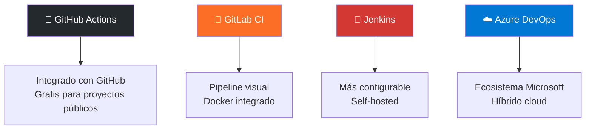
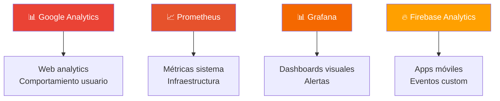

# Construcción, Medición y Aprendizaje en Bucle

Esta fase representa el motor del proyecto, donde la planificación estratégica se transforma en un producto tangible. En el enfoque MVP, el objetivo no es construir todo de una vez, sino establecer un ciclo rápido y eficiente de "Construir-Medir-Aprender" que maximice el aprendizaje y minimice el desperdicio de recursos.

## Ejecución: La Fábrica de Software Automatizada

La **Ejecución** se fundamenta en la creación de una "fábrica" de software automatizada mediante la **Integración Continua y Despliegue Continuo (CI/CD)**. Esta metodología trasciende la simple automatización de tareas; se convierte en el motor que acelera nuestro ciclo de aprendizaje. Un pipeline de CI/CD robusto reduce significativamente el "coste de la experimentación", permitiendo probar nuevas ideas en producción en cuestión de horas en lugar de semanas.

Este sistema revoluciona el desarrollo al permitir integrar, probar y desplegar cambios de forma segura y en minutos, acelerando dramáticamente el proceso de aprendizaje y validación de hipótesis.

## Monitoreo y Control: Más Allá de las Métricas Tradicionales

El **Monitoreo y Control** evoluciona más allá de la vigilancia tradicional del tiempo y coste, focalizándose en la medición de **KPIs (Indicadores Clave de Rendimiento)** que reflejen genuinamente el comportamiento del usuario. Las preguntas clave son: ¿Se registran los usuarios? ¿Utilizan realmente la nueva funcionalidad? ¿Cómo interactúan con el producto?

## El Arte del Pivotaje Estratégico

Basándose en estos datos cuantitativos y cualitativos, el equipo desarrolla la capacidad de aprender continuamente y puede tomar la decisión estratégica de cambiar de dirección o enfoque, una acción conocida como **pivotar**. Es importante entender que pivotar no constituye un simple ajuste táctico, sino un cambio de rumbo estratégico fundamentado en datos concretos.

El caso más emblemático es **Slack**: comenzaron desarrollando un videojuego, observaron que nadie lo utilizaba, pero descubrieron que la herramienta de chat interna que habían creado para coordinarse resultaba extremadamente valiosa. Pivotaron estratégicamente para convertirse en la empresa de comunicación empresarial que conocemos hoy.

## Caja de Herramientas - Ejecución y Monitorización

### CI/CD (Integración y Despliegue Continuo)

### Monitorización y Analytics

**Recomendaciones por Especialidad:**
- **DAW**: _GitHub Actions_ + _Google Analytics_ + _Grafana_
- **DAM**: _GitHub Actions_ + _Firebase Analytics_ + _Crashlytics_  

**Aplicación Práctica: El Ecosistema TaskFlow en Construcción**

En esta fase, vemos cómo ambos equipos no solo construyen sus respectivos MVPs, sino que **coordinan sus ciclos de aprendizaje** para crear un ecosistema coherente y robusto.

:::: tabs
== DAW
* **Caso DAW (`TaskFlow Web`):**
    * **Ejecución**: El equipo desarrolla la aplicación web y su API REST, configurando un pipeline de CI/CD con GitHub Actions. Cada commit ejecuta tests automáticos tanto de la interfaz como de la API. **Prioridad especial**: la API debe estar estable para que DAM pueda consumirla.
    * **Monitoreo y Aprendizaje**: Se implementa Google Analytics para la web y logging específico de la API. **Insight clave**: el 85% de las peticiones a la API vienen de la app móvil (DAM), validando la estrategia multi-plataforma. Se observó que las operaciones de "mover tareas" tardaban más de lo esperado. **Acción coordinada**: se optimizó la API y se avisó al equipo DAM del cambio de tiempos de respuesta.

== DAM
* **Caso DAM (`TaskFlow Mobile`):**
    * **Ejecución**: Desarrollo de la app móvil con CI/CD mediante GitHub Actions y distribución a testers vía Firebase App Distribution. **Dependencia crítica**: el equipo debe esperar a que DAW estabilice ciertos endpoints antes de implementar funcionalidades.
    * **Monitoreo y Aprendizaje**: Uso de Firebase Analytics y Crashlytics. **Descubrimiento importante**: los usuarios móviles intentan usar la app sin conexión un 40% del tiempo. **Aprendizaje del ecosistema**: esta información ayuda al equipo DAW a priorizar funcionalidades offline en su roadmap futuro.

::::

> **Ciclo de Aprendizaje del Ecosistema**: Los insights de un equipo benefician al otro. DAM detecta patrones de uso → DAW optimiza la API → DAM mejora la experiencia móvil → El ciclo se repite.
