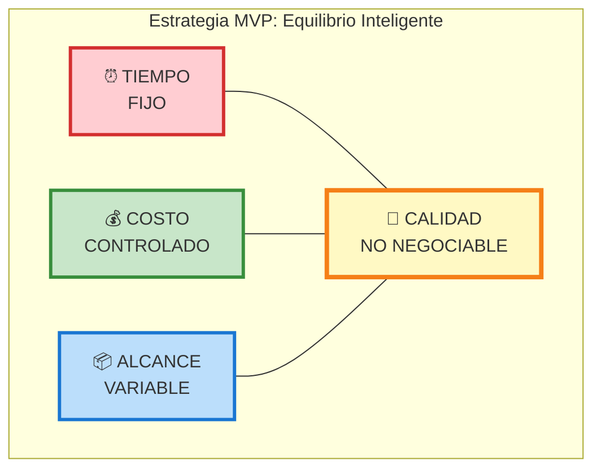
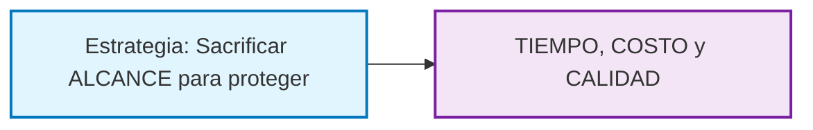

# La Estrategia de la Triple Restricción

**Teoría:**
La Triple Restricción (Alcance, Tiempo, Costo) con la Calidad en el centro, es el marco estratégico que guía todas las decisiones en un proyecto. Para ayudar a interiorizar el concepto, imagina que eres un malabarista con tres bolas: Alcance, Tiempo y Costo. La estrategia del MVP consiste en admitir que no puedes hacer las tres bolas más grandes a la vez. Por ello, decides conscientemente que la bola del "Alcance" será muy pequeña y manejable. Esto te permite mantener las otras dos (Tiempo y Costo) en el aire sin que se te caiga la base sobre la que te apoyas: la Calidad.

**El Alcance es la variable que se sacrifica sin piedad** para proteger las demás. El **Tiempo** se fija y se hace corto para acelerar el aprendizaje. El **Costo** se mantiene controlado como consecuencia de limitar los dos anteriores. La **Calidad**, sin embargo, **no es negociable**. Cuando decimos que la calidad no es negociable, nos referimos a la calidad profesional y técnica. El código está limpio, es mantenible y la experiencia de usuario para las pocas funcionalidades que existen es excelente. No significa que sea perfecto o libre de errores, sino que no es una "chapuza" que haya que tirar a la basura en la siguiente versión. Lo poco que se construye debe ser robusto, profesional y funcionar con excelencia técnica. Un MVP es un producto enfocado, no un producto con errores.

## Infografía: La Triple Restricción en MVP

### Detalles de Cada Restricción

| 🔴 **TIEMPO (FIJO)** | 🟢 **COSTO (CONTROLADO)** | 🔵 **ALCANCE (VARIABLE)** | 🟡 **CALIDAD (NO NEGOCIABLE)** |
|----------------------|---------------------------|---------------------------|--------------------------------|
| Sprints cortos | Recursos limitados | Solo Must Have | Código limpio |
| Entregas rápidas | Herramientas eficientes | Funcionalidades mínimas | Experiencia profesional |
| Feedback inmediato | Equipo mínimo | Valor esencial | Base sólida para crecer |

### En Práctica: Tomando Decisiones

Cuando el equipo se enfrenta a presión (y siempre la habrá), la Triple Restricción actúa como brújula:

- **❌ "Necesitamos más funcionalidades"** → Respuesta: Reducir alcance de otra parte, mantener calidad
- **❌ "No hay tiempo suficiente"** → Respuesta: Reducir alcance o funcionalidades, mantener calidad  
- **❌ "El presupuesto se agota"** → Respuesta: Reducir alcance, mantener calidad
- **❌ "Esto no funciona bien"** → Respuesta: **NUNCA** negociar calidad

**Aplicación Práctica: La Triple Restricción en el Ecosistema TaskFlow**

:::: tabs
== DAW

**Caso DAW (TaskFlow Web):**
* **Alcance**: Se limitó a 5-6 funcionalidades clave (registro, creación de proyectos/tareas, tablero básico, invitaciones y API), descartando ideas como los comentarios o las fechas de entrega para el lanzamiento inicial.
* **Tiempo y Costo**: Se fijó un plazo de 4 semanas y un costo mínimo utilizando herramientas de código abierto y planes de hosting gratuitos.
* **Calidad**: No se negoció. El código de la API REST se escribió con tests de integración para asegurar que el equipo DAM tuviera una base estable sobre la que construir.

> 💡 **Lección Clave**: La calidad de la API no era solo para TaskFlow Web, sino **para todo el ecosistema**. Una API mal diseñada habría condenado al fracaso también a DAM.

== DAM

**Caso DAM (TaskFlow Mobile):**
* **Alcance**: Extremadamente limitado. La app solo permitía ver y mover tareas existentes. Se descartó la creación de proyectos, la edición de tareas y el modo offline. Se eligió una sola plataforma (Android) para el MVP.
* **Tiempo y Costo**: Se fijó un plazo de 6 semanas (dependiente de la API de DAW), con un costo limitado a las cuentas de desarrollador y un plan básico de Firebase.
* **Calidad**: No negociable. La app debía sincronizar con la API de forma rápida y sin errores. Una mala experiencia de sincronización habría invalidado la propuesta de valor de la movilidad.

> 💡 **Interdependencia Crítica**: El equipo DAM sacrificó alcance propio para asegurar que su dependencia con la API de TaskFlow Web funcionara perfectamente.

::::

## La Triple Restricción Como Estrategia de Ecosistema

**Lección Fundamental**: En el ecosistema TaskFlow, la Triple Restricción no operó solo a nivel individual de cada equipo, sino como una **estrategia coordinada**:

### Decisiones Interconectadas:
- **DAW** sacrificó alcance (comentarios, fechas) pero **no negoció** la calidad de la API → **DAM** pudo confiar en una base sólida
- **DAM** sacrificó alcance (modo offline, creación de proyectos) pero **no negoció** la sincronización → **Usuarios** tuvieron experiencia coherente entre web y móvil  

### Resultado del Ecosistema:
**Los usuarios finales recibieron un producto cohesivo y profesional**, aunque limitado, porque cada equipo aplicó la Triple Restricción pensando no solo en su componente, sino en **cómo afectaba al conjunto**.

> 💡 **Insight Clave**: La Triple Restricción en proyectos intermodulares requiere sacrificar alcance individual para **proteger la calidad del ecosistema completo**.
