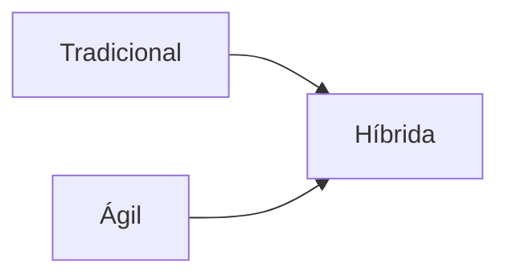
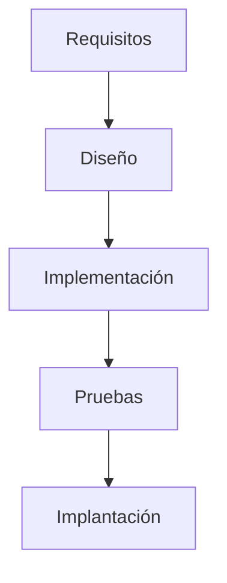
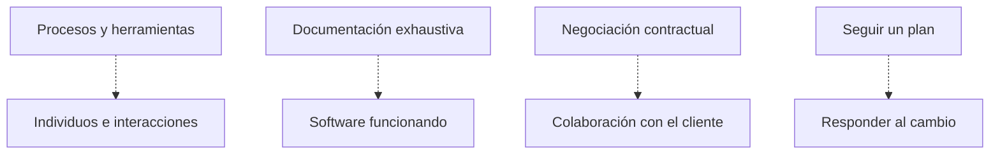
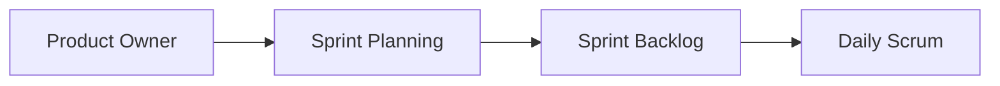

<SlidesViewer>

# **Metodologías Ágiles: De la teoría a la práctica**

### Proyecto Intermodular II | Metodologías ágiles. Scrum

-----

## ¿Qué vamos a aprender hoy?

Un recorrido completo por las metodologías de desarrollo de proyectos, desde los enfoques tradicionales hasta las ágiles, con especial atención a Scrum y su aplicación práctica.

**Ejemplo central: TaskFlow y la gestión ágil en equipos reales.**

1. **¿Qué es una metodología?**
2. **Tradicional vs Ágil:** diferencias clave.
3. **El Manifiesto Ágil y sus principios.**
4. **Scrum:** roles, artefactos y ceremonias.
5. **Evolución de un Sprint real.**

-----

# **Capítulo 1: ¿Qué es una metodología?**

## ¿Qué es una metodología?

> **Una metodología de desarrollo de proyectos es un conjunto organizado de principios, procesos, técnicas y herramientas que sirven como guía para planificar, ejecutar, controlar y cerrar un proyecto.**

### Tipos principales

| Tipo           | Características principales                  |
|----------------|---------------------------------------------|
| Tradicional    | Secuencial, mucha planificación, poca flexibilidad |
| Ágil           | Iterativa, adaptable, entrega continua      |
| Híbrida        | Combina lo mejor de tradicional y ágil      |

-----

# **Capítulo 2: Metodologías Tradicionales**

## Metodologías Tradicionales

 > Se caracterizan por una fuerte planificación inicial y una ejecución lineal de las fases del proyecto

### Modelos principales

| Modelo         | Descripción breve |
|----------------|------------------|
| Cascada        | Fases lineales, cada una depende de la anterior |
| V              | Relaciona desarrollo y pruebas en paralelo |

**Ventajas:** claridad, documentación, previsibilidad.

**Inconvenientes:** rigidez, poca adaptación al cambio.

**Ejemplo:** desarrollo de una app de reservas de aulas siguiendo fases secuenciales.

-----

# **Capítulo 3: Metodologías Ágiles**

## Metodologías Ágiles

  > Promueven el desarrollo iterativo e incremental. Se centran en la entrega continua de valor, la colaboración, la adaptación al cambio y la retroalimentación constante.

### El Manifiesto Ágil

| Valor tradicional         | Valor Ágil                  |
|--------------------------|-----------------------------|
| Procesos y herramientas  | Individuos e interacciones  |
| Documentación exhaustiva | Software funcionando        |
| Negociación contractual  | Colaboración con el cliente |
| Seguir un plan           | Responder al cambio         |

**Ventajas:** flexibilidad, reducción de riesgos, satisfacción del cliente.

**Inconvenientes:** requiere disciplina, menos documentación.

**Ejemplos:** Scrum, Kanban, XP.

-----

# **Capítulo 4: Scrum (I) - Fundamentos**

### Roles clave

| Rol             | Función principal |
|-----------------|------------------|
| Product Owner   | Prioriza y define el producto |
| Scrum Master    | Facilita y protege el proceso |
| Equipo Desarrollo | Construye el producto |

### Ceremonias

- **Sprint:** ciclo de trabajo fijo
- **Planning:** planificación del Sprint
- **Daily:** reunión diaria de seguimiento
- **Review:** revisión del incremento
- **Retrospectiva:** mejora continua

### Artefactos

- **Product Backlog:** lista priorizada de requisitos
- **Sprint Backlog:** tareas del Sprint
- **Incremento:** resultado funcional

-----

# **Capítulo 5: Scrum (II) - Planificación y Ejecución**

**Scrum Master:** facilita, elimina bloqueos, fomenta la autoorganización.

**Sprint Planning:** define el objetivo y selecciona tareas.

**Sprint Backlog:** plan de trabajo vivo y transparente.

**Daily Scrum:** inspección y adaptación diaria.

-----

# **Capítulo 6: Scrum (III) - Refinamiento y Mejora Continua**

**Refinamiento:** pulir y detallar el Product Backlog.

**Sprint Review:** inspección del incremento y feedback de stakeholders.

**Retrospectiva:** análisis del proceso y acciones de mejora.

**Buenas prácticas:** ambiente seguro, foco en una mejora clave.

**Errores comunes:** refinar demasiado pronto o tarde, falta de seguimiento.

-----

# **Capítulo 7: Ejemplo Práctico de Scrum**

**TaskFlow:** aplicación real de Scrum en equipos DAW, DAM y ASIR.

| Equipo  | Nº integrantes | Roles principales |
|---------|---------------|------------------|
| DAW     | 5             | Frontend, Backend, QA |
| DAM     | 4             | Mobile Dev, Backend, QA |
| ASIR    | 3             | DevOps, Sysadmin |

**Evolución de artefactos:**

- Product Backlog inicial con historias de usuario
- Sprint Planning y selección de tareas
- Daily Scrum y adaptación
- Review y Retrospectiva conjunta

-----

# **Herramientas y Actividad Práctica**

**Herramientas recomendadas:**

- Notion: gestión de proyectos y tableros Kanban
- Trello: visualización de tareas y sprints
- Jira: seguimiento ágil profesional

**Actividad:**

1. Elige una herramienta y crea un tablero Kanban para tu proyecto.
2. Simula un Sprint: define tareas, realiza Daily, Review y Retrospectiva.
3. Aplica una mejora continua en el siguiente Sprint.

-----

# **¿Preguntas?**

</SlidesViewer>
